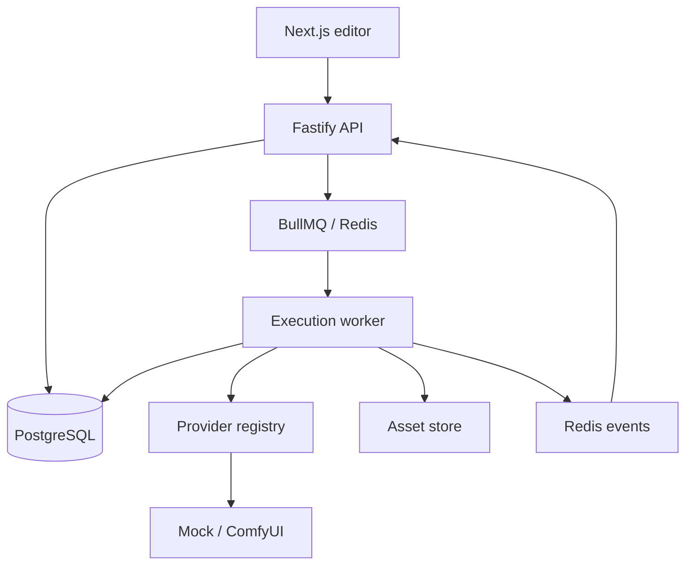
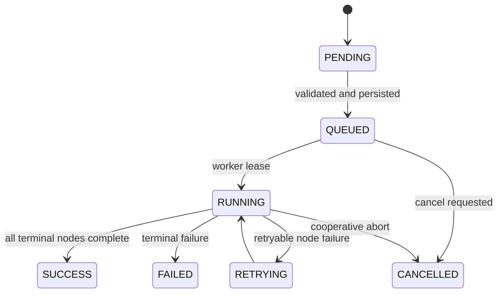
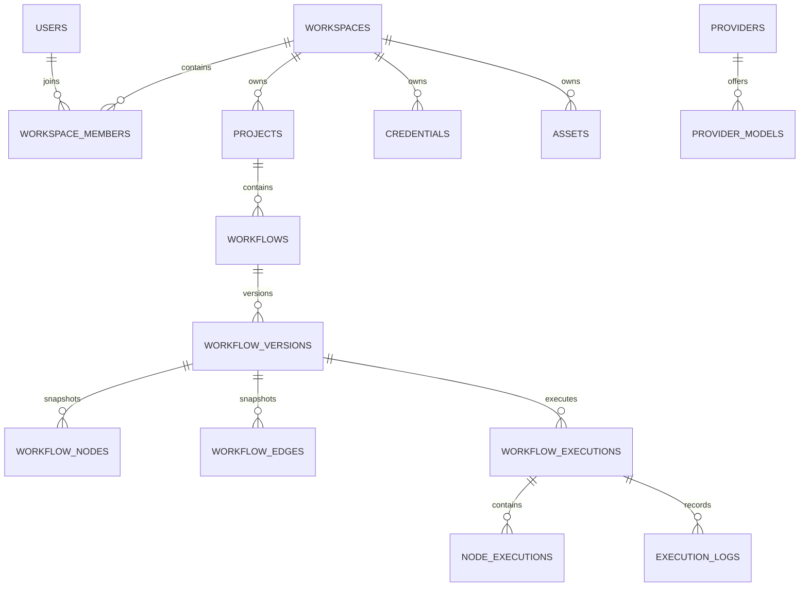
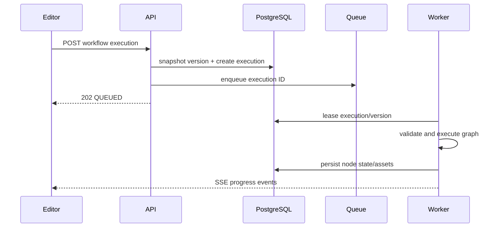

# GenFlow architecture proposal and MVP decision record

## 1. Product boundary

GenFlow is a multi-tenant visual workflow application for AI content production. The editor
stores a typed graph; it does not embed execution semantics. A saved workflow produces an
immutable `workflow_version`, and every execution points to exactly one version. Provider
selection is configuration resolved through a capability registry, never a branch scattered
through workflow business logic.

The implemented MVP supports input, text generation, image generation, video generation, and
output nodes. Condition, loop, manual approval, HTTP, and sandboxed code are represented as
future node contracts but are intentionally not executable until their safety and state-machine
semantics are complete.

## 2. System architecture



### Sources of truth

| Concern | Source of truth | Explicitly not the source |
| --- | --- | --- |
| Workflow definition | immutable PostgreSQL workflow version | React Flow state |
| Execution state | PostgreSQL execution/node rows | BullMQ job state |
| Binary assets | S3-compatible storage | node output JSON |
| Scheduling transport | BullMQ/Redis | an open HTTP request |
| Provider availability | backend provider registry | frontend constants |

Redis is disposable coordination infrastructure. Rebuilding queue/event state must not change
the recorded execution history.

## 3. Monorepo boundaries

```text
apps/web                 Next.js UI and API client
apps/api                 HTTP, authentication, authorization, SSE, orchestration
workers/execution-worker long-running execution consumer
packages/workflow-types  canonical schemas and boundary types
packages/workflow-core   graph validation, planning, and execution state machine
packages/provider-sdk    capability contracts and provider registry/adapters
packages/database        Drizzle schema and repositories
packages/validation      environment and request validation
packages/shared          errors, API envelopes, IDs, redaction
```

Dependencies point inward: UI and frameworks may depend on domain packages; domain packages do
not depend on Next.js, Fastify, BullMQ, PostgreSQL, or React Flow.

## 4. Workflow and node model

A graph contains nodes and directed edges. Each edge addresses explicit source/target ports.
Validation is deterministic and runs in both API and worker:

1. schema and ID uniqueness;
2. registered node type and port existence;
3. port cardinality and type compatibility;
4. no self-edge or duplicate edge;
5. acyclic graph for the MVP;
6. at least one terminal output and no unreachable executable node.

Compatible types are exact matches plus the safe `any` escape hatch controlled by node authors.
There is no implicit text-to-image coercion.

```json
{
  "schemaVersion": 1,
  "name": "Text to image",
  "nodes": [
    {
      "id": "prompt",
      "type": "input.text",
      "position": { "x": 80, "y": 180 },
      "config": { "value": "A quiet winter city at blue hour" }
    },
    {
      "id": "image",
      "type": "ai.image.generate",
      "position": { "x": 400, "y": 180 },
      "config": { "providerId": "mock", "model": "mock-image-v1" }
    },
    {
      "id": "output",
      "type": "output.asset",
      "position": { "x": 720, "y": 180 },
      "config": {}
    }
  ],
  "edges": [
    {
      "id": "prompt-image",
      "source": "prompt",
      "sourcePort": "text",
      "target": "image",
      "targetPort": "prompt"
    },
    {
      "id": "image-output",
      "source": "image",
      "sourcePort": "asset",
      "target": "output",
      "targetPort": "asset"
    }
  ]
}
```

## 5. Execution lifecycle



The API transaction snapshots a workflow version and creates the execution before enqueueing.
The worker revalidates the stored version, computes topological batches, and executes independent
nodes concurrently with a configured cap. Each node attempt is persisted before and after the
provider call. Retry uses exponential backoff with a stable idempotency key. Cancellation is
cooperative and checked at every scheduling boundary.

Events use an outbox-friendly envelope (`eventId`, `occurredAt`, `executionId`, optional
`nodeExecutionId`, type, payload). The MVP publishes through Redis. A future transactional
outbox can be added without changing SSE clients.

## 6. Provider architecture

Providers declare capabilities (`text.generate`, `image.generate`, `video.generate`) and models.
Nodes request a capability and provider ID. `ProviderRegistry.resolve()` returns a typed adapter
or a structured `PROVIDER_UNAVAILABLE` error. Core execution never knows brand-specific APIs.

Credentials are referenced by ID. The API never returns ciphertext or plaintext credentials.
Adapters receive decrypted secrets only inside the worker process, and log redaction runs before
structured data is emitted.

ComfyUI is implemented as a provider adapter that submits a workflow prompt and polls history.
Its base URL passes SSRF checks; private addresses are allowed only through an explicit
development flag.

## 7. Database design



All tenant-owned tables carry `workspace_id`; repositories require an authorization context and
include it in every read/write predicate. UUID primary keys prevent cross-shard coordination.
Large append-only tables (`execution_logs`, `node_executions`) are indexed by execution and time
and can be range-partitioned later. JSONB is limited to version snapshots, provider metadata,
and outputs whose shape is validated at application boundaries; searchable identity/status fields
remain normalized columns.

## 8. API and request flow

REST mutates durable resources. SSE only streams transient progress.



Every JSON response uses `{ data, meta? }`; every failure uses
`{ error: { code, message, details?, requestId } }`. Idempotency keys are accepted on execution
creation. Optimistic workflow updates use the expected current version.

## 9. Frontend architecture and UX

TanStack Query owns server state. A focused Zustand store owns only the unsaved editor graph,
selection, history, and viewport operations. React Flow is an adapter over that store. Server
versions replace the editor state only on explicit load/restore.

The first viewport is the working surface: compact header, searchable node library, canvas,
inspector, and collapsible execution console. Dark graphite surfaces, capability color accents,
and restrained perspective/hover motion create depth without reducing legibility. Motion respects
`prefers-reduced-motion`; no decorative animation blocks editing.

## 10. Security

- password hashes use a slow adaptive hash and JWTs have bounded lifetimes;
- every project/workflow/execution query is scoped to the authenticated workspace;
- credentials use AES-256-GCM with a deployment key outside the database;
- secret-shaped keys are recursively redacted from logs;
- provider and HTTP URLs reject non-HTTP protocols and private/link-local targets by default;
- uploads enforce size, MIME, and object-key rules;
- expressions use a token parser, never `eval`;
- the Code node is disabled until an isolated sandbox exists;
- rate limiting, restrictive CORS, request size limits, and audit events sit at the API boundary.

## 11. Scalability and technical-debt register

| Risk | MVP decision | Scale path |
| --- | --- | --- |
| Redis event loss | progress is transient; DB is canonical | transactional outbox + replay cursor |
| Hot execution tables | composite indexes | time partitioning and cold archive |
| Duplicate provider work | idempotency key per node attempt | provider-specific reconciliation |
| Very large graphs | bounded node/edge validation limits | incremental planner / graph service |
| Loop semantics | disabled in DAG MVP | explicit loop controller and iteration rows |
| Multi-region storage | single configured bucket | regional asset replicas and signed CDN |
| Credential rotation | encrypted row with key version | envelope encryption/KMS and rewrap jobs |

## 12. Delivery phases

1. Domain contracts, validation, schema, and decision records.
2. Auth/project/workflow APIs and immutable persistence.
3. Editor, node library, connections, inspector, save/validate.
4. Execution queue, worker, SSE, cancellation/retry.
5. Mock and ComfyUI providers plus asset storage.
6. Execution history, templates, responsive and accessibility polish.

Each phase must pass strict TypeScript, lint, unit tests, and production build before release.
